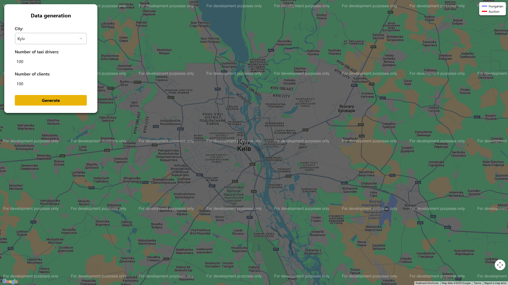
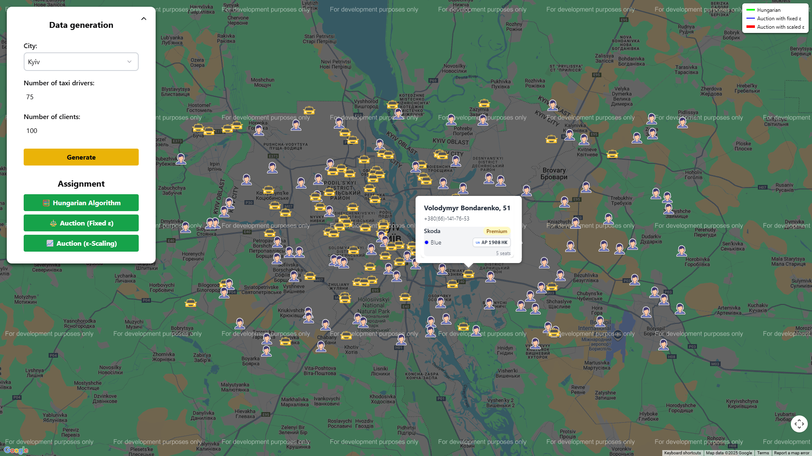
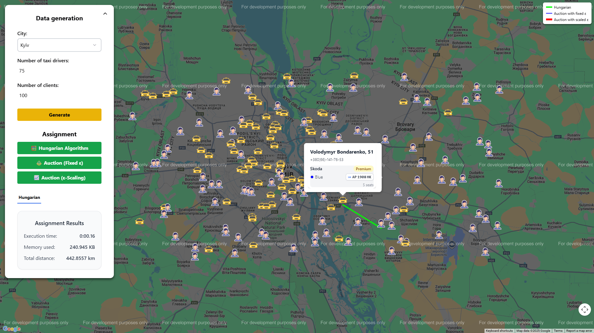
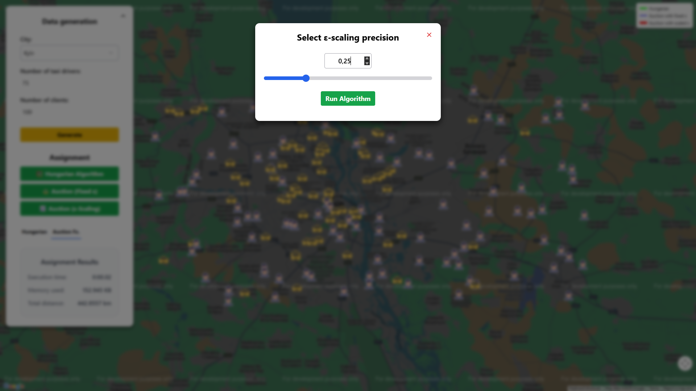

# Description

The **Taxi Assignment** project is a web application built using **ASP.NET Core Web API** and **React**.  
It simulates the optimal distribution of taxi drivers to clients using classical assignment algorithms and provides an interactive visualization on **Google Maps**.

## Key Features

### Data Generation
- Users can select a **city**.  
- Generate a custom number of **drivers** and **clients** with randomly assigned data:
  - `Name`, `Surname`, `Age`, `PhoneNumber`, `Latitude`, `Longitude`.
- Driver locations are loaded from **.csv files** located in the project folder.
- Each driver includes a **Car** object containing:
  - `Class`, `Brand`, `LicensePlate`, `Color`, `SeatsCount`.

### Interactive Map Visualization
- Generated drivers and clients are displayed on a **Google Map** that fills the screen.  
- Each driver and client is represented by a distinct icon.
- Clicking on a driver or client displays their connection lines showing assignment routes.

### Assignment Algorithms and Results
The system provides three methods for optimal driver-client matching:
  1. **Hungarian Algorithm**.
  2. **Auction Algorithm with fixed ε**.
  3. **Auction Algorithm with ε-scaling**.

After running an algorithm, the application displays detailed results, including:
- Execution time (in minutes, seconds and milliseconds).
- Memory usage (displayed in bytes, kilobytes or megabytes).
- Total assignment distance (in meters or kilometers, depending on scale).
- Visual connection between each assigned driver and client (shown as straight lines on the map).

This project demonstrates algorithmic optimization and real-world simulation of logistics tasks.  
It combines backend computation efficiency with interactive frontend visualization to provide an educational and experimental environment for understanding assignment algorithms.

# Technology Stack
## Backend: ASP.NET Core Web API (C#)  
  - Built on **.NET 9.0** for modern features and performance improvements.
  - Handles API endpoints for generating drivers and clients, running assignment algorithms and returning results.
  - Data for driver locations is read from CSV files stored in the project.

The following NuGet packages were integrated during the development process:

### Logging (Serilog)
- **Serilog.AspNetCore 9.0.0** — integrates Serilog logging into ASP.NET Core applications.  
- **Serilog.Sinks.Async 2.1.0** — enables asynchronous logging to improve performance.  
- **Serilog.Sinks.Console 6.0.0** — logs output to the console.  
- **Serilog.Sinks.File 7.0.0** — logs output to files.

### API Documentation
- **Swashbuckle.AspNetCore 9.0.6** — generates Swagger/OpenAPI documentation for APIs.
- **Microsoft.AspNetCore.OpenApi 9.0.9** — provides minimal APIs OpenAPI integration.  
- **Microsoft.AspNetCore.Mvc.NewtonsoftJson 9.0.9** — enables JSON serialization and deserialization using Newtonsoft.Json.

### SPA / Development
- **Microsoft.AspNetCore.SpaProxy 9.0.9** — allows proxying requests to a frontend development server (like Vite/React).

### Testing
- **coverlet.collector 6.0.2** — collects code coverage data for tests.  
- **Microsoft.NET.Test.Sdk 17.12.10** — provides the test SDK for running unit tests.  
- **xunit 2.9.2** — unit testing framework.  
- **xunit.runner.visualstudio 2.8.2** — enables running xUnit tests inside Visual Studio.

## Frontend: React (TypeScript)  
  - Provides an interactive web interface for generating data, running algorithms and visualizing results on a map.
  - Integrated with **Google Maps API** for displaying drivers, clients and assignment lines.
  - Uses **Chakra UI** for UI components and **Tailwind CSS** for styling.

The project also uses several supporting libraries for HTTP requests, theming and icons:
- **@chakra-ui/react 3.27.0** — provides ready-to-use UI components and styling system.  
- **@emotion/react 11.14.0** — enables CSS-in-JS styling for React components.  
- **@react-google-maps/api 2.20.7** — integrates Google Maps into React applications.  
- **@tailwindcss/vite 4.1.14** — TailwindCSS plugin for Vite, used for utility-first styling.  
- **axios 1.12.2** — HTTP client for making API requests to the backend.  
- **next-themes 0.4.6** — allows managing light/dark themes in the app.  
- **react 19.1.1** — core React library.  
- **react-dom 19.1.1** — React DOM rendering library.  
- **react-icons 5.5.0** — icon library for React components.

# Installing and running the project

## Clone the repository
1. Open **Visual Studio**.
2. In the Start window, select **"Clone repository"**.
3. In the **"Repository location"** dialog, paste the following link:
   ```bash
   https://github.com/SaigoTora/TaxiAssignment.git
   ```
4. Select the path where the project will be cloned on your computer.
5. Click the **"Clone"** button.

## Installing dependencies
The project uses several NuGet packages. To install them:
1. Right-click the solution in **Solution Explorer**.
2. In the context menu, select **"Restore NuGet Packages"**. Visual Studio will automatically install all the necessary packages.

## Building and running the project
1. Press **Ctrl + Shift + B** to build the project.
2. Press **F5** to run the project in debug mode or select **"Run without debugging"** (**Ctrl + F5**) for a normal run.

## Additional Setup Requirements

Before running the project, the following API configuration is required:

### 1. Google Maps API
1. Create a **Google account** if you don’t already have one.  
2. Go to the [Google Cloud Console](https://console.cloud.google.com/) and create a new project.  
3. Enable the **Maps JavaScript API** for your project.  
4. Generate an **API key**.  
5. In your React application, create a `.env` file in the root directory (if it doesn’t exist) and add the following line:  
  ```env
  VITE_GOOGLE_MAPS_API_KEY=YOUR_API_KEY
  ```
Replace YOUR_API_KEY with the API key you generated. This key is required for displaying maps, markers and assignment connections in the application.

# How to Use

1. Enter the **city**, number of **drivers** and number of **clients**.  
2. Click **Generate** to create the data.  
3. Choose an **assignment algorithm** and click the corresponding button.  
4. Review the **results**: execution time, memory usage, total distance and see **which driver was assigned to which client** on the map.

## Screenshots
Below are some screenshots demonstrating the key interfaces of the **Taxi Assignment** project.

**Initial Map View**



**Generated Drivers and Clients**



**Hungarian Algorithm Results**



**Auction Algorithm (Fixed ε) Results**


**ε-Scaling Precision Selection**



**Auction Algorithm (Scaled ε) Results**

